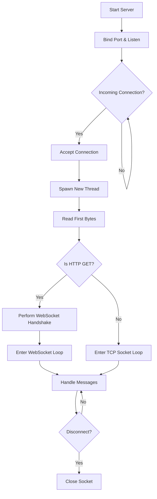
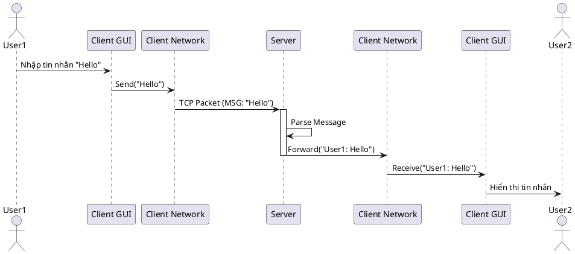

# Tài Liệu Thiết Kế - Ứng Dụng Chat Real-Time

## 1. Pseudo Code (Mã Giả)

### Server Loop (Người 1)
```text
START Server
    Initialize ServerSocket on Port X
    Listen for connections
    WHILE True:
        ClientSocket = Accept Connection
        Create new Thread(HandleClient, ClientSocket)
        Start Thread
    END WHILE
END Server

FUNCTION HandleClient(ClientSocket):
    TRY:
        Receive LoginRequest from ClientSocket
        Validate User
        Add Client to ActiveClientsList
        Broadcast "User Joined" to All
        
        WHILE True:
            Message = Receive from ClientSocket
            IF Message is EXIT:
                BREAK
            ELSE IF Message is PRIVATE:
                Send to Specific Client
            ELSE:
                Broadcast Message to All
        END WHILE
    FINALLY:
        Remove Client from ActiveClientsList
        Close ClientSocket
        Broadcast "User Left"
    END TRY
END FUNCTION
```

## 2. Flowchart (Lưu đồ thuật toán)

### Server Connection Handling (Updated with WebSocket)


### WebSocket Handshake Flow
1.  **Client** sends HTTP GET request with `Upgrade: websocket` and `Sec-WebSocket-Key`.
2.  **Server** computes `Sec-WebSocket-Accept` = Base64(SHA1(Key + MagicGUID)).
3.  **Server** sends HTTP 101 Switching Protocols response.
4.  **Connection** upgrades to WebSocket (Binary Frames).

## 3. Workchart (Phân công theo thời gian)

| Tuần | Công việc | Người phụ trách |
| :--- | :--- | :--- |
| **Tuần 1** | Thiết kế Protocol, Cấu trúc Project, Setup Git | Cả nhóm (Lead: Người 1) |
| **Tuần 2** | **Người 1**: Code Server cơ bản (Connection)<br>**Người 2**: Code Client Network & Protocol<br>**Người 3**: Thiết kế Mockup GUI<br>**Người 4**: Thiết kế Database Schema | Chia theo role |
| **Tuần 3** | **Người 1**: Broadcast & Threading<br>**Người 2**: Tích hợp Protocol vào Client<br>**Người 3**: Code GUI (Login, Chat frame)<br>**Người 4**: Code Login/Register DB | Chia theo role |
| **Tuần 4** | **Người 3**: Ghép GUI với Client Logic<br>**Người 4**: Tích hợp DB vào Server<br>**Người 1 & 2**: Test kết nối & Fix bug | Tích hợp |
| **Tuần 5** | Testing toàn bộ, Viết báo cáo, Slide | Cả nhóm |

## 4. PlantUML (Sequence Diagram)

### Kịch bản: Gửi tin nhắn

